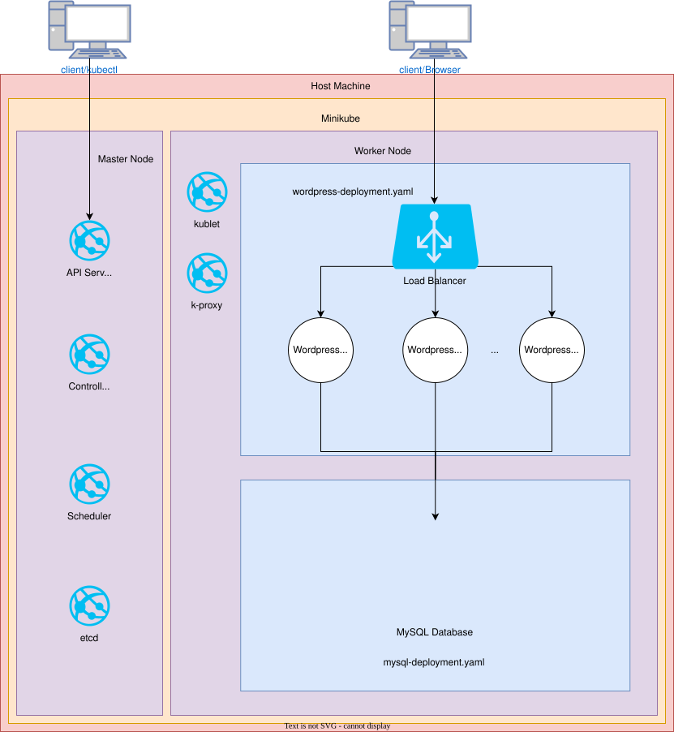

# Introduction
This application describes two separate entities. One is a Minikube Kubernetes cluster hosting a WordPress website connected to a MySQL database. The other is a separate Jenkinsfile describing a Jenkins CI/CD pipeline that builds and deploys a trading app image located on Azure Container Registry (ACR) to a Kubernetes cluster hosted on Azure Kubernetes Service (AKS) acting as a dev environment.

# Minikube Application Architecture
The Minikube application defines two separate deployments. The first deployment defines a Load Balancer and a pod hosting the WordPress application. By default, our configuration does not provide pod replication, but it's a simple process to set up replication and auto-scaling by editing the WordPress deployment file. The second deployment sets up the MySQL database that communicates with the WordPress pods to store data.

# Jenkins CI/CD pipeline
This pipeline starts by defining all necessary environment variables. Some of this is defining the Jenkins image agent and where it can get the image. This initialization step is also where credentials to log into Azure and set up an AKS cluster are defined. Credentials are given values in a custom menu on the Jenkins server page. We use this to avoid hardcoding secrets in our Jenkinsfile and promote security. Once the environment is ready, the actual CI/CD stages begin. First is initialization, which involves logging into Azure through a previously set-up Service Principal. Next is the Build stage, which uses the image we provided in the environment variables to set up a container that runs our application. Finally, we deploy our application using Azure CLI commands to set up AKS and deploy the container created from our image.

# Improvements
Setting up the Service Principal used in the CI/CD pipeline is a fairly manual process. It would be nice to automate this portion of the pipeline and grant the proper permissions to the Service Principal so that the build process can be a bit more seamless.