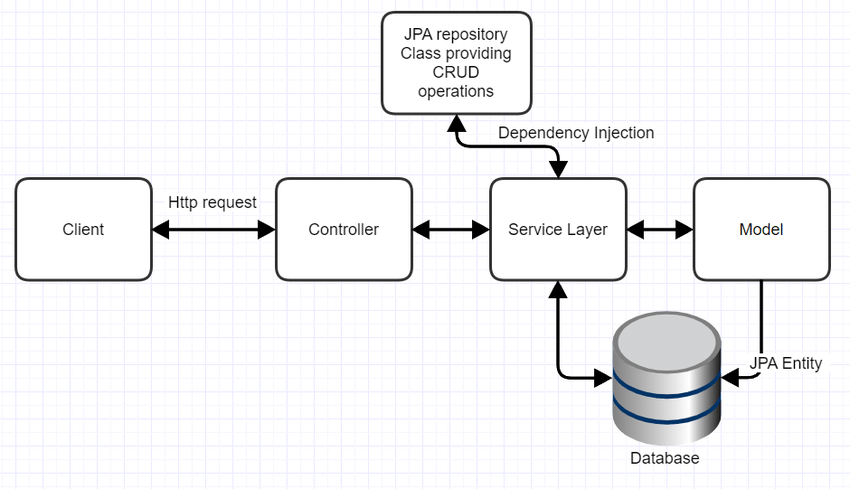

# MongoDB Spring Boot Insurance App
This application defines an API used to interface with a car insurance database that details information about people in addition to their ownership of vehicles. It defines several API calls to retrieve query information from the associated database for making business decisions. This API is built using Java through the Spring Boot Framework. It follows the standard Maven application structure. The application connects to a provided MongoDB database with connection parameters defined in the `application.properties` file. API calls are made to the application using Postman.

Technologies: MongoDB, Core Java, Spring Boot, Maven, Postman, Git, GitHub

# Quick Start
Dependencies: Maven, JDK version 17 (Minimum), Postman

Verify that your mongodb database is up and running. 

Navigate to `insurance_mongo/src/main/resources` and modify the `application.properties` file to connect to your database's IP and port number. It is set to default local mongoDB database settings by default. 

To build the application, run the following command in the `insurance_mongo` directory:

`mvn package`

To run the application, run the following command (You can skip the preceding steps on subsequent uses of the application):

`java -jar target/insurance-mongo-0.0.1-SNAPSHOT.jar ca.jrvs.insurance_api.InsuranceApiApplication`

Once the application is up and running, API calls can be made to the application using Postman. The following is a list of built-in API calls and their functionality (alongside the type of HTTP request):

```
POST: [IP]:[Port]/insurance_api/person
 - Adds a person to the database as defined by the JSON you provide in the Postman Body field.

PATCH: [IP]:[Port]/insurance_api/person
 - Updates a person in the database in accordance to the JSON you provide in the Postman Body field. The specific person is determined by the ID you provide.

GET: [IP]:[Port]/insurance_api/people
 - Get a listing of all the people in the database.

POST: [IP]:[Port]/insurance_api/people
 - Adds a number of people to the database as defined by the JSON you provide in the Postman Body field.

DELETE: [IP]:[Port]/insurance_api/people
 - Delete all people from the database.

PATCH: [IP]:[Port]/insurance_api/people
 - Updates a number of people in the database in accordance to the JSON you provide in the Postman Body field. The specific people are determined by the IDs your provide.

GET: [IP]:[Port]/insurance_api/uninsuredDrivers
 - Returns a listing of all people in the database that own a car, but do not currently have insurance.

GET: [IP]:[Port]/insurance_api/person/{id}
 - Returns a specific person from the database based on the ID you provide at the end of the API call.

DELETE: [IP]:[Port]/insurance_api/person/{id}
 - Removes a specific person from the database based on the ID you provide at the end of the API call.

GET: [IP]:[Port]/insurance_api/people/{ids}
 - Returns a specific set of people from the database based on the IDs you provide at the end of the API call.

DELETE: [IP]:[Port]/insurance_api/people/{ids}
 - Removes a specific set of people from the database based on the IDs you provide at the end of the API call.

GET: [IP]:[Port]/insurance_api/numUninsuredMinors
 - Returns the total number of minors in the database that own a car, but do not have insurance.

GET: [IP]:[Port]/insurance_api/numUninsuredFastDrivers
 - Returns the total number of drivers in the database that drive fast cars (At least 200mph), but do not have insurance.

GET: [IP]:[Port]/insurance_api/numCarlessAdults
 - Returns the total number of adults in the database that do not have a car registered to their person.

GET: [IP]:[Port]/insurance_api/mostPopularMake
 - Returns the most popular make of car among people listed in the database.

GET: [IP]:[Port]/insurance_api/maxCars
 - Returns the number of cars owned by the person in the database with the most cars.

GET: [IP]:[Port]/insurance_api/count
 - Returns the total number of people in the database.

GET: [IP]:[Port]/insurance_api/canadianFordCustomers
 - Returns a listing of all Canadian people in the database that own a Ford car.

GET: [IP]:[Port]/insurance_api/avgAge
 - Returns the average age of people in the database.

```

# Implemenation

Implementation followed the standard structure of Spring Boot applications:
- Models of the relevent data were created through three seperate classes detailing the defining features of a person, car, and address. The car and address classes effectively ask as internal objects to define a person's car ownership and home address respectively. Individual instances of the Person class represent the actual data stored in our database.
- The `PersonRepository.java` repository was created to extend the basic MongoRepository interface in order to provide common query operations for use by the service layer. Most of the basic functionality for service layer methods was provided by the MongoRepository interface, but custom aggregations provided by this application were created in the PersonRepository interface.
- The service layer essentially holds the business logic associated with individual API calls. Most basic database calls did not need robust business logic, but a few notable operations, like record updating and dealing with null returns from database calls were handled here to ensure API calls to certain functions behaved as a user may expect.
- The controller named and defined the API calls available to users and acted as a connection to the service layer which would actually make calls to the database to retrieve requested information.
- Finally, API calls are made through Postman which acts as the client to make HTTP requests to the controller.

## Architecture


# Testing
Aggregation testing was performed manually by comparing API call output to the output of using those same aggregations in both the MongoDB shell or in the MongoDB Compass aggregation interface.
Aggregation testing mostly confirmed the functionality of repository, service, and controller methods, but additional testing was needed to confirm proper output for edge cases. Some examples of this include calls to aggregations that expected an integer return, but sometimes returned null due to no documents in the database matching the aggregation filters. In these cases, some methods had to be modified to return 0 whenever aggregations returned a null value.

# Deployment
The application is available only through this GitHub repository. Downloading the insurance-mongo folder and running the `InsuranceApiApplication.java` located in `insurance-mongo/src/main/java/ca/jrvs/insurance-api` is sufficient to begin using this application on your local machine. If you intend to connect this database to an external IP, please see the instructions for changing the IP and Port connect under "Quick Start" above.

# Potential Improvements
- Writing additional built in aggregation queries as API calls to better reflect the kind of information users would want to frequently grab from such a database. 
- Creating a user-friendly front-end to make the user experience with this product a bit more intuitive and friendly without requiring services like Postman in order to make API calls.
- Provide comprehensive documentation detailing how to go about creating additional custom API calls in case users of this product want to create additional custom queries. 
