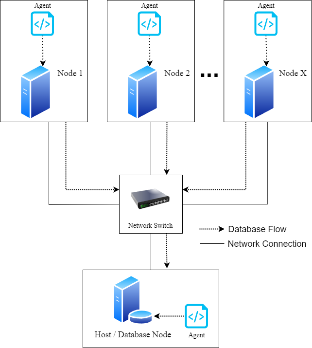

# What is Linux Cluster Monitor (LCM)
LCM is a Linux server cluster monitor that utilizes a monitoring agent to extract node performance metrics and hardware data to populate a PostgreSQL database. LCM is meticulously crafted for simplicity, automating virtually every aspect of its workflow to guarantee ease of use by system administrators, facilitating swift identification of performance bottlenecks. LCM features a script to automate the deployment of the PSQL database using a Docker container. After successfully building the container, a DDL script creates the database tables that store performance data. Once the schema is operational, the Bash monitoring agent can be distributed to cluster nodes to begin data collection. Crontab can be used to set the time interval of data collection on individual nodes. 

Technologies: Docker, PostgreSQL, Bash Script, Crontab, Git, GitHub

# Quick Start
Use the steps below to get LCM up and running. To use LCM, you must have Docker installed on the host machine where your database will maintain its Docker volume.
```
# Dependencies: Docker
# Create a psql instance using psql_docker.sh
./psql_docker.sh create [db_username] [db_password]

# Start the psql container using psql_docker.sh
./psql_docker.sh start

# Connect to PSQL and create a database to store monitoring data
psql -h [host_address] -U [db_username] -W
CREATE DATABASE [db_name];

# Create the database tables using ddl.sql
psql -h [host_address] -U [db_username] -d [db_name] -f [Path to ddl.sql]

# Distribute the host_info.sh and host_usage.sh scripts to relevent nodes

# Insert hardware specification data into the database using host_info.sh
./host_info.sh [psql_host address] [psql_port] [db_name] [db_username] [db_password]

# The following entry will add a single snapshot of a node's usage at the time of the command 
# You can skip to Crontab setup if you want to automate the gathering of data on a specific interval

# Insert hardware usage data into the database using host_usage.sh
./host_usage.sh [psql_host address] [psql_port] [db_name] [db_username] [db_password]

# Crontab setup (1 minute interval indicated by five *)
# If you wish to collect data on a different interval, use "https://crontab.guru" to set your custom interval
crontab -e
* * * * * bash [Absolute Path to host_usage.sh] [host_address] [psql_port] [db_name] [db_username] [db_password] > /tmp/host_usage.log

```

# Implemenation
Implementation occurred in five phases:
- Developed the `psql_docker.sh` script to automate the deployment of a Docker container to house our PSQL database.
- Automated the implementation of the database schema by building the `ddl.sql` script.
- Built `host_info.sh` script to extract node hardware information using Linux pipelines and inserted the data into the database.
- Implemented `host_usage.sh` script to extract node usage data using Linux pipelines and inserted the data into the database.
- Scheduled the automatic execution of `host_usage.sh` through Crontab to extract node usage information on a fixed interval.

## Architecture


## Scripts
Shell Script and Crontab description and usage
- `psql_docker.sh`: Used to create an instance of a PSQL database by utilizing a PSQL image pulled from Docker Hub to build a container. The script also manages starting and stopping the instance. To utilize this script, use the following commands:
```
# Create a psql instance
./psql_docker.sh create [db_username] [db_password]

# Start the psql container
./psql_docker.sh start

# Stop the psql container
./psql_docker.sh stop
```
- `host_info.sh`: Populates the `host_info` table with the current node's hardware information. It is executed once on each node in the cluster to log the node in the database and provide a reference point for the `host_usage` table. To utilize this script, use the following command: \
`./host_info.sh [psql_host address] [psql_port] [db_name] [db_username] [db_password]`

- `host_usage.sh`: Populates the `host_usage` table with the current node's usage information. It should be scheduled to run regularly using a tool like Crontab to monitor node usage and performance over an extended period. To utilize this script, use the following command: \
`./host_usage.sh [psql_host address] [psql_port] [db_name] [db_username] [db_password]`

- `crontab`: A Unix job scheduler used to run specific jobs/commands at a user-specified interval. Usage: \
`crontab -e` will open a text editor for scheduling jobs at a regular interval.
- `queries.sql`: A file containing three diagnostic queries useful for identifying underperforming or failing nodes.

## Database Modeling
LCM stores node information across two tables in the database. The `host_info` table records information about node hardware specifications and assigns an ID to each node. The `host_usage` table records usage and performance information and is populated regularly by each node using a tool like Crontab. 

Database Table Model and Sample Data:

`host_info`:

| id | hostname  | cpu_number | cpu_architecture | cpu_model                      | cpu_mhz | l2_cache | timestamp               | total_mem |
|----|-----------|------------|------------------|--------------------------------|---------|----------|-------------------------|-----------|
| 1  | host-node | 1          | x86_64           | Intel(R) Xeon(R) CPU @ 2.30GHz | 2300    | 256      | 2019-05-29 17:49:53.000 | 601324    |

- `id`: The primary key of the host_info table identifying each unique node. It is automatically generated and incremented on each new table entry due to being a SERIAL field.
- `hostname`: Name of the machine.
- `cpu_number`: Number of logical cores on the machine.
- `cpu_architecture`: The CPU architecture.
- `cpu_model`: Model of the CPU.
- `cpu_mhz`: Clock speed of the cpu in MHz.
- `l2_cache`: Size of the L2 Cache in kB.
- `timestamp`: Timestamp at the time of recording.
- `total_mem`: Total memory (RAM) available to this machine in MB.

`host_usage`:

| timestamp               | host_id | memory_free | cpu_idle | cpu_kernel | disk_io | disk_available |
|-------------------------|---------|-------------|----------|------------|---------|----------------|
| 2019-05-29 17:49:53.000 | 1       | 300000      | 90       | 4          | 2       | 3              |

- `timestamp`: Timestamp at the time of recording.
- `host_id`: The id of the node. Foreign key referencing the `id` column of the `host_info` table.
- `memory_free`: Memory (RAM) available for use (in MB).
- `cpu_idle`: CPU idle time in percentage.
- `cpu_kernel`: Time spent running kernel code in percentage.
- `disk_io`: Number of blocks currently being written to disk.
- `disk_available`: Space available in the root directory (in MB).

# Testing
- `psql_docker.sh`: Tested the three possible input conditions (Create/Start/Stop) manually to verify that they worked as intended. `Bash -x` was used to verify proper script flow.
- `ddl.sql`: Verified to work as intended by creating an empty database and using the DDL script to create its tables.
- `host_info.sh`: Verified that each pipeline extracted the correct system information and manually constructed and verified an insert statement to populate the table. `Bash -x` was used to verify proper script flow.
- `host_usage.sh`: Used the same process as `host_info` as the two scripts are very similar in functionality.
- `crontab`: Verified that `host_usage` scheduling was working as intended by confirming that input to the table occurred at the correct interval. Crontab output was redirected to a log file as a second point of verification that it was running on the intended interval.

# Deployment
LCM is available through this GitHub repository and operates through Docker to instantiate a PSQL database for logging node information and usage data. Crontab schedules the regular collection of usage data for each node. LCM operates through Docker and Crontab (common to all unix distros) to provide environment-agnostic monitoring data regardless of which specific distros your nodes use.

# Potential Improvements
Write at least three things you want to improve 
e.g. 
- At the moment, LCM does not provide functionality to update the host_info table for a given node if any hardware in the node happens to change. We aim to automate the procedure for refreshing node information. 
- In the same vein as the above improvement, we want to provide a means to automate the removal of nodes from the database if they are no longer part of the cluster.
- Provide comprehensive documentation explaining the process of extracting usage and hardware information if a user wants to monitor additional or differing data within their database.
- [Minor] Running the `psql_docker.sh` script floods the terminal with unnecessary information from `docker container inspect`. Suppress its output to keep the terminal clean, as it is only currently used for the exit code it generates.
