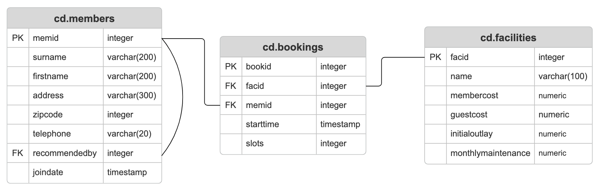

# Intro
This project serves as practice in rapid database deployment in addition to writing various SQL queries and commands. It is primarily designed for educational purposes and is not intended for use by any specific users. The PostgreSQL database is deployed through a Docker Container to provide an isolated and easy-to-provision environment for SQL command and DDL construction practice. A DDL script builds the database structure. Several statements listed in the README perform various queries on the database to practice different forms of data retrieval.

Technologies: PostgreSQL, Docker, SQL Language, Git, GitHub

# Queries

###### Table Setup (DDL)



```
CREATE TABLE IF NOT EXISTS cd.members (
	memid integer NOT NULL,
	surname varchar(200) NOT NULL,
	firstname varchar(200) NOT NULL,
	address varchar(300) NOT NULL,
	zipcode integer NOT NULL,
	telephone varchar(20) NOT NULL,
	recommendedby integer,
	joindate timestamp NOT NULL,
	CONSTRAINT pk_members PRIMARY KEY (memid),
	CONSTRAINT fk_members_recommendedby FOREIGN KEY (recommendedby) REFERENCES cd.members(memid) ON DELETE SET NULL
);

CREATE TABLE IF NOT EXISTS cd.bookings (
	bookid integer NOT NULL,
	facid integer NOT NULL,
	memid integer NOT NULL,
	starttime timestamp NOT NULL,
	slots integer NOT NULL,
	CONSTRAINT pk_bookings PRIMARY KEY (bookid),
	CONSTRAINT fk_bookings_facid FOREIGN KEY (facid) REFERENCES cd.facilities(facid),
	CONSTRAINT fk_bookings_memid FOREIGN KEY (memid) REFERENCES cd.members(memid)
);

CREATE TABLE IF NOT EXISTS cd.facilities (
	facid integer NOT NULL,
	name varchar(100) NOT NULL,
	membercost numeric NOT NULL,
	guestcost numeric NOT NULL,
	initialoutlay numeric NOT NULL,
	monthlymaintenance numeric NOT NULL,
	CONSTRAINT pk_facilities PRIMARY KEY (facid)
);
```

###### Insert some data into a table 
```sql
INSERT INTO cd.facilities 
VALUES 
  (9, 'Spa', 20, 30, 100000, 800);
```

###### Insert calculated data into a table
INSERT INTO cd.facilities 
VALUES 
  (
    (
      SELECT 
        max(facid) 
      FROM 
        cd.facilities
    )+ 1, 
    'Spa', 
    20, 
    30, 
    100000, 
    800
  );
```

###### Update some existing data
```sql
UPDATE 
  cd.facilities 
SET 
  initialoutlay = 10000 
WHERE 
  facid - 1;
```

###### Update a row based on the contents of another row
```sql
UPDATE 
  cd.facilities 
SET 
  membercost = (
    SELECT 
      membercost 
    FROM 
      cd.facilities 
    WHERE 
      facid = 0
  ) * 1.1, 
  guestcost = (
    SELECT 
      guestcost 
    FROM 
      cd.facilities 
    WHERE 
      facid = 0
  ) * 1.1 
WHERE 
  facid = 1;
```

###### Delete all bookings
```sql
DELETE FROM 
  cd.bookings;
```

###### Delete a member from the cd.members table
```sql
DELETE FROM 
  cd.members 
WHERE 
  memid = 37;
```

###### Produce a list of facilities that charge a fee to members, and that fee is less than 1/50th of the monthly maintenance cost
```sql
SELECT 
  facid, 
  name, 
  membercost, 
  monthlymaintenance 
FROM 
  cd.facilities 
WHERE 
  membercost > 0 
  AND membercost < (monthlymaintenance / 50);
```

###### Basic string search
```sql
SELECT 
  * 
FROM 
  cd.facilities 
WHERE 
  name LIKE '%Tennis%';
```

###### Matching against multiple possible values
```sql
SELECT 
  * 
FROM 
  cd.facilities 
WHERE 
  facid IN (1, 5);
```

###### Produce a list of members who joined after the start of September 2012
```sql
SELECT 
  memid, 
  surname, 
  firstname, 
  joindate 
FROM 
  cd.members 
WHERE 
  joindate >= '2012-09-01';
```

###### Combining results from multiple queries
```sql
SELECT 
  surname 
FROM 
  cd.members 
UNION 
SELECT 
  name 
FROM 
  cd.facilities;
```

###### Retrieve the start times of members' bookings
```sql
SELECT 
  bk.starttime 
FROM 
  cd.bookings bk 
  JOIN cd.members mem ON (bk.memid = mem.memid) 
WHERE 
  mem.firstname = 'David' 
  AND mem.surname = 'Farrell';
```

###### Work out the start times of bookings for tennis courts
```sql
SELECT 
  bk.starttime, 
  fc.name 
FROM 
  cd.bookings bk 
  JOIN cd.facilities fc ON (fc.facid = bk.facid) 
WHERE 
  bk.starttime >= '2012-09-21' 
  AND bk.starttime < '2012-09-22' 
  AND fc.name LIKE 'Tennis%' 
ORDER BY 
  starttime;
```

###### Produce a list of all members, along with their recommender
```sql
SELECT 
  mem.firstname, 
  mem.surname, 
  rec.firstname AS reclname, 
  rec.surname AS recsname 
FROM 
  cd.members mem 
  LEFT JOIN cd.members rec ON (mem.recommendedby = rec.memid) 
ORDER BY 
  mem.surname, 
  mem.firstname;
```

###### Produce a list of all members who have recommended another member
```sql
SELECT 
  DISTINCT rec.firstname, 
  rec.surname 
FROM 
  cd.members mem 
  JOIN cd.members rec ON (mem.recommendedby = rec.memid) 
ORDER BY 
  rec.surname, 
  rec.firstname;
```

###### Produce a list of all members, along with their recommender, using no joins.
```sql
SELECT 
  DISTINCT (
    mem.firstname || ' ' || mem.surname
  ) AS member, 
  (
    SELECT 
      (
        rec.firstname || ' ' || rec.surname
      ) AS recommender 
    FROM 
      cd.members rec 
    WHERE 
      mem.recommendedby = rec.memid
  ) 
FROM 
  cd.members mem 
ORDER BY 
  member;
```

###### Count the number of recommendations each member makes.
```sql
SELECT 
  recommendedby, 
  count(*) 
FROM 
  cd.members 
WHERE 
  recommendedby IS NOT NULL 
GROUP BY 
  recommendedby 
ORDER BY 
  recommendedby;
```

###### List the total slots booked per facility
```sql
SELECT 
  facid, 
  sum(slots) AS "Total Slots" 
FROM 
  cd.bookings 
GROUP BY 
  facid 
ORDER BY 
  facid;
```

###### List the total slots booked per facility in a given month
```sql
SELECT 
  facid, 
  sum(slots) AS "Total Slots" 
FROM 
  cd.bookings 
WHERE 
  starttime >= '2012-09-01' 
  AND starttime < '2012-10-01' 
GROUP BY 
  facid 
ORDER BY 
  "Total Slots";
```

###### List the total slots booked per facility per month
```sql
SELECT 
  facid, 
  extract(
    month 
    FROM 
      starttime
  ) AS month, 
  sum(slots) AS "Total Slots" 
FROM 
  cd.bookings 
WHERE 
  extract(
    year 
    FROM 
      starttime
  ) = 2012 
GROUP BY 
  facid, 
  month 
ORDER BY 
  facid, 
  month;
```

###### Find the count of members who have made at least one booking
```sql
SELECT 
  count(DISTINCT memid) 
FROM 
  cd.bookings;
```

###### List each member's first booking after September 1st 2012
```sql
SELECT 
  mem.surname, 
  mem.firstname, 
  mem.memid, 
  min(bk.starttime) AS starttime 
FROM 
  cd.members mem 
  JOIN cd.bookings bk ON (mem.memid = bk.memid) 
WHERE 
  bk.starttime >= '2012-09-01' 
GROUP BY 
  mem.memid 
ORDER BY 
  mem.memid;
```

###### Produce a list of member names, with each row containing the total member count
```sql
SELECT 
  count(*) OVER (), 
  firstname, 
  surname 
FROM 
  cd.members 
ORDER BY 
  joindate;
```

###### Produce a numbered list of members
```sql
SELECT 
  row_number(*) OVER (
    ORDER BY 
      joindate
  ), 
  firstname, 
  surname 
FROM 
  cd.members 
ORDER BY 
  joindate;
```

###### Output the facility id that has the highest number of slots booked
```sql
SELECT 
  facid, 
  total 
FROM 
  (
    SELECT 
      facid, 
      sum(slots) AS total, 
      rank() OVER (
        ORDER BY 
          sum(slots) DESC
      ) rank 
    FROM 
      cd.bookings 
    GROUP BY 
      facid
  ) AS ranking 
WHERE 
  rank = 1;
```

###### Format the names of members
```sql
SELECT 
  (surname || ', ' || firstname) AS name 
FROM 
  cd.members;
```

###### Find telephone numbers with parentheses
```sql
SELECT 
  memid, 
  telephone 
FROM 
  cd.members 
WHERE 
  telephone SIMILAR TO '%[()]%' 
ORDER BY 
  memid;
```

###### Count the number of members whose surname starts with each letter of the alphabet
```sql
SELECT 
  substr(surname, 1, 1) as letter, 
  count(*) 
FROM 
  cd.members 
GROUP BY 
  letter 
ORDER BY 
  letter;
```
